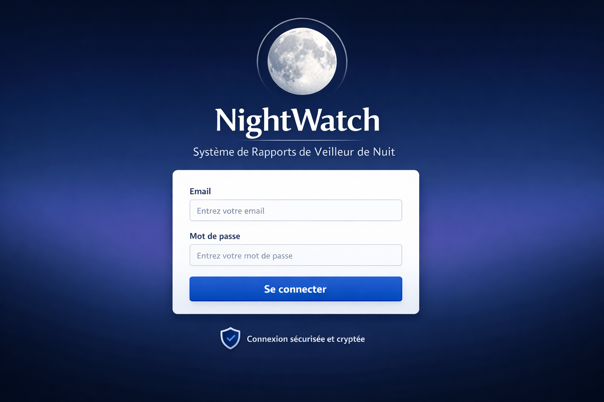
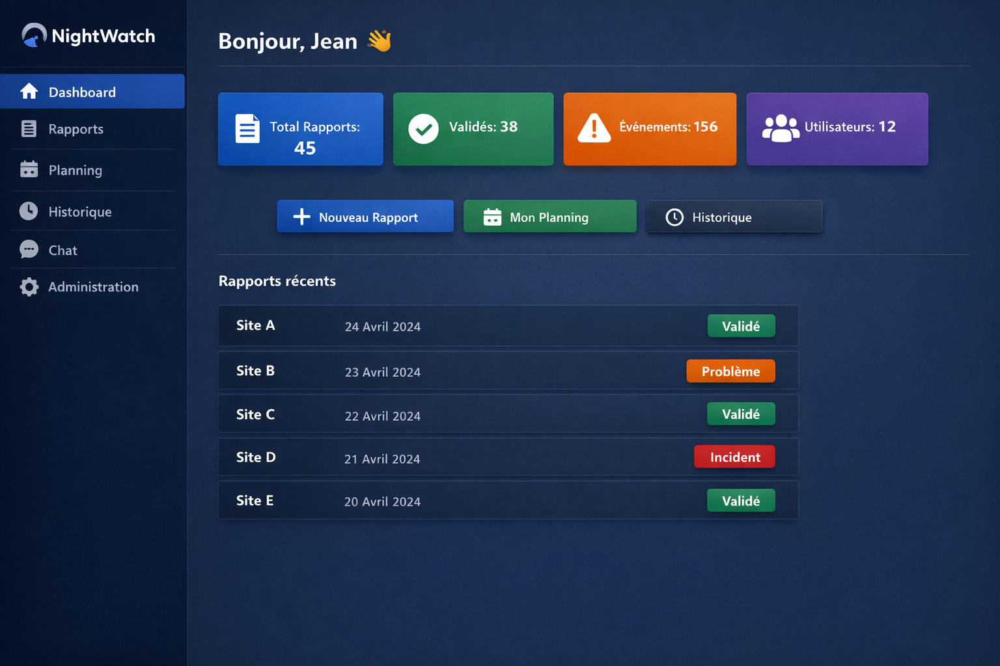
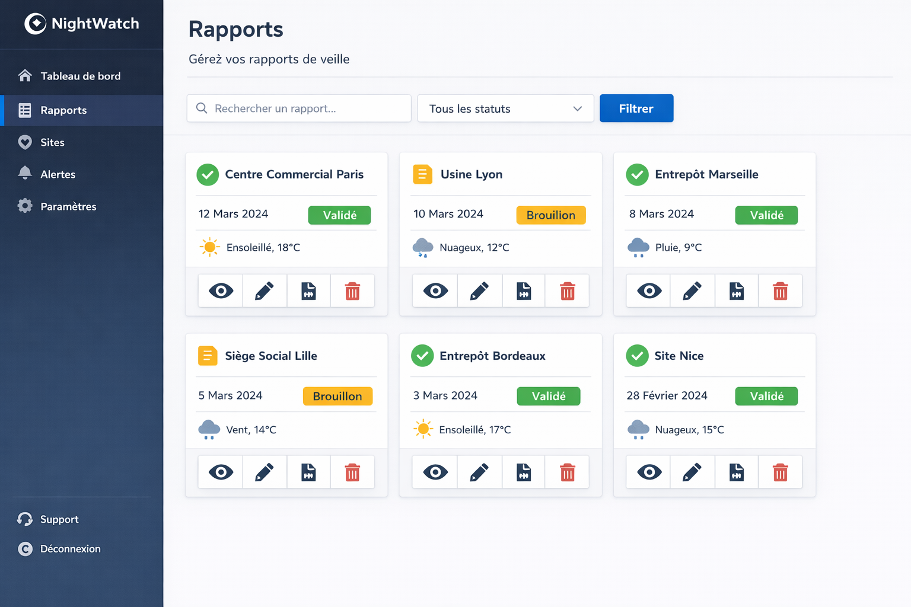
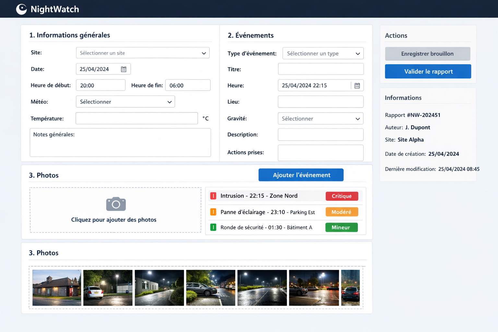
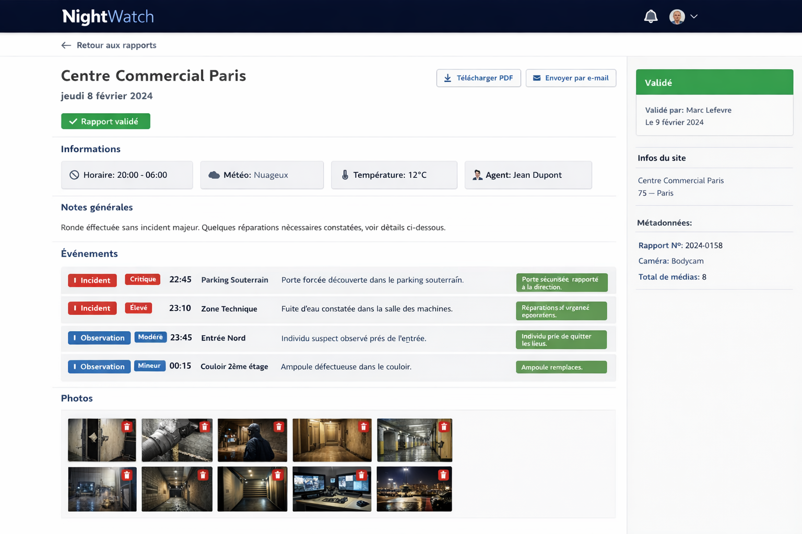
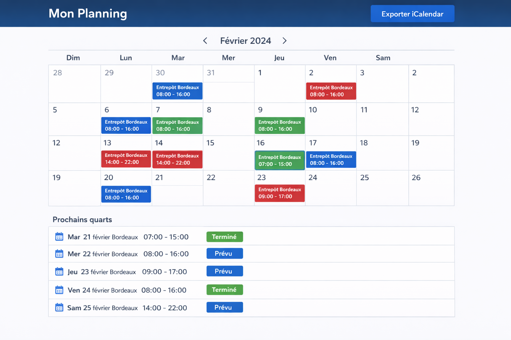
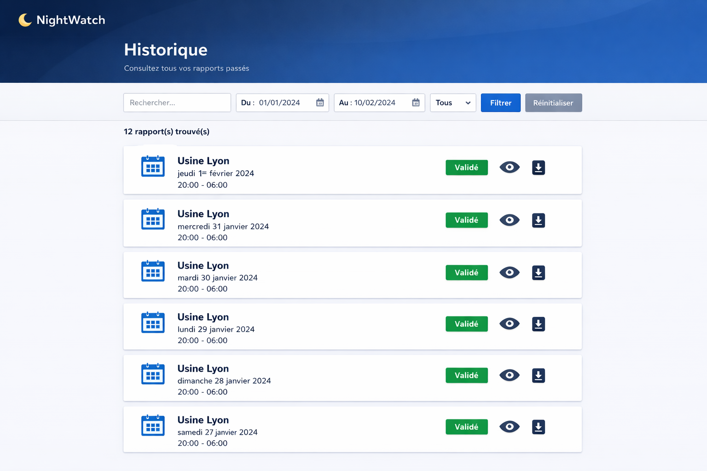
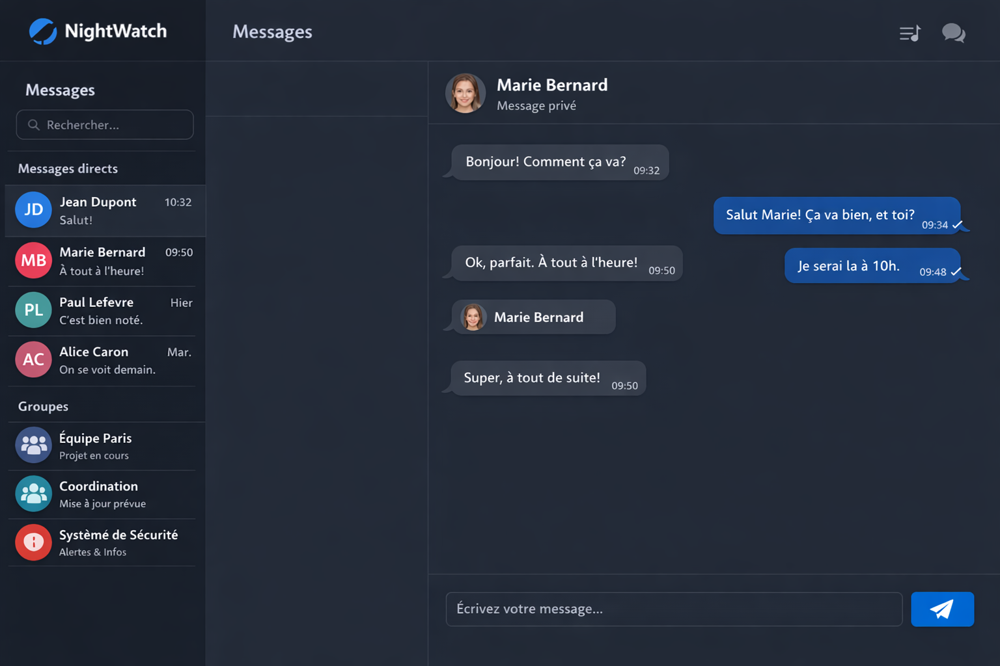
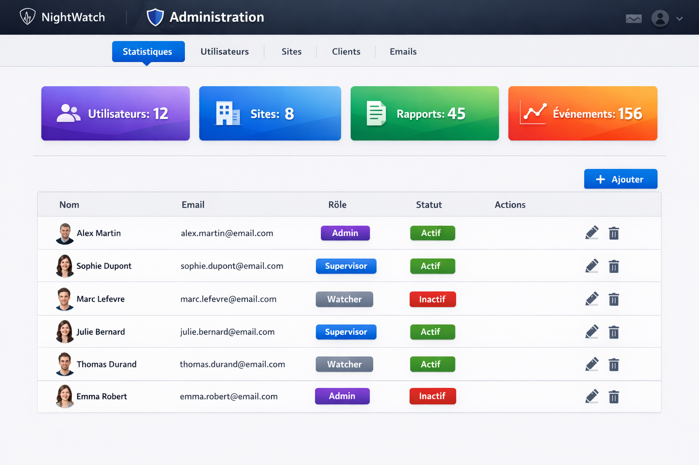
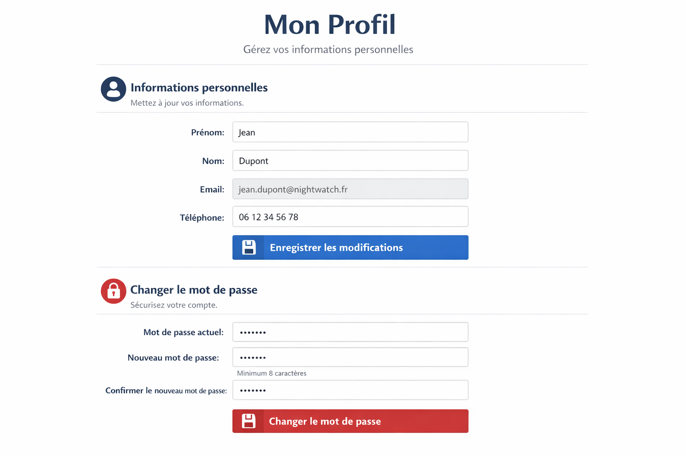

# NightWatch - Application de Rapports de Veilleur de Nuit

Application complète pour la gestion des rapports de veilleur de nuit, multi-sites et multi-clients.

## 🌟 Fonctionnalités

### Pour les Veilleurs de Nuit
- ✅ Création, modification et suppression de rapports
- ✅ Gestion des brouillons avec sauvegarde automatique
- ✅ Ajout d'événements (incidents, observations, rondes)
- ✅ Upload de photos avec gestion de galeries
- ✅ Validation des rapports (non-modifiables après validation)
- ✅ Génération automatique de PDF
- ✅ Envoi d'emails de reporting
- ✅ Consultation du planning mensuel
- ✅ Historique complet des rapports
- ✅ Chat intégré pour la communication

### Pour les Administrateurs
- 👥 Gestion des utilisateurs et des droits
- 🏢 Gestion des sites et des clients
- 📧 Configuration des destinataires d'emails
- 📊 Statistiques et dashboard
- 🔒 Sécurité avancée et conformité RGPD
- 📅 Import/Export du planning (API RH, iCal)

### Sécurité et RGPD
- 🔐 Authentification JWT sécurisée
- 🔒 Cryptage des données sensibles en base
- 🛡️ Protection contre les attaques (Helmet, Rate Limiting)
- 📝 Logs d'audit conformes au RGPD
- 🔐 Connexions SSL/TLS
- 🚫 Accès par rôle (Admin, Supervisor, Watcher)

## 🛠️ Stack Technique

### Backend
- **Node.js** - Runtime JavaScript
- **Express** - Framework web
- **MySQL** - Base de données relationnelle
- **Socket.io** - Communication temps réel (Chat)
- **JWT** - Authentification
- **bcryptjs** - Hashage des mots de passe
- **pdfkit** - Génération PDF
- **nodemailer** - Envoi d'emails
- **multer** - Upload de fichiers

### Frontend
- **React 18** - Framework UI
- **Vite** - Build tool
- **Tailwind CSS** - Framework CSS
- **React Router** - Routing
- **Axios** - Client HTTP
- **Socket.io Client** - Communication temps réel
- **Lucide React** - Icônes
- **React Hot Toast** - Notifications

## 📦 Installation

### Prérequis
- Node.js 18+ et npm
- MySQL 8.0+
- Windows 11 / Linux / macOS

### Installation Automatique (Windows 11)

```powershell
# Exécuter en tant qu'administrateur
.\install.ps1
```

### Installation Manuelle

#### 1. Cloner le projet
```bash
git clone <repository-url>
cd nightwatch
```

#### 2. Installer les dépendances Backend
```bash
cd backend
npm install
```

#### 3. Configurer l'environnement Backend
```bash
cp .env.example .env
# Éditer .env avec vos configurations
```

#### 4. Configurer la base de données MySQL
```bash
mysql -u root -p < database/schema.sql
```

#### 5. Installer les dépendances Frontend
```bash
cd ../frontend
npm install
```

#### 6. Démarrer l'application

**Backend:**
```bash
cd backend
npm start
```

**Frontend:**
```bash
cd frontend
npm run dev
```

### Configuration de l'environnement

Créez un fichier `.env` dans le dossier `backend`:

```env
# Base de données
DB_HOST=localhost
DB_USER=root
DB_PASSWORD=votre_mot_de_passe
DB_NAME=nightwatch_db
DB_PORT=3306

# JWT
JWT_SECRET=votre_clé_secrète_très_longue_et_sécurisée
JWT_EXPIRE=24h

# SMTP (Emails)
SMTP_HOST=smtp.gmail.com
SMTP_PORT=587
SMTP_USER=votre_email@gmail.com
SMTP_PASSWORD=votre_mot_de_passe_application

# Serveur
PORT=5000
NODE_ENV=production
FRONTEND_URL=http://localhost:5173

# API RH (Optionnel)
RH_API_KEY=votre_clé_api_combo
RH_API_URL=https://api.combo.fr

# Uploads
UPLOAD_DIR=./uploads

# Cryptage (32 caractères minimum)
ENCRYPTION_KEY=clé_de_cryptage_32_caractères_minimum!!
```

## 🚀 Utilisation

### Premier démarrage

1. **Accéder à l'application**
   - URL: http://localhost:5173

2. **Connexion Admin par défaut**
   - Email: `admin@nightwatch.fr`
   - Mot de passe: `Admin123!`
   - ⚠️ **IMPORTANT**: Changez ce mot de passe immédiatement !

3. **Configuration initiale**
   - Créer les utilisateurs
   - Ajouter les sites et clients
   - Configurer les destinataires d'emails
   - Importer ou créer le planning

### Workflow Type

**Pour un veilleur de nuit:**

1. **Connexion** avec ses identifiants
2. **Vérifier le planning** pour connaître les sites à surveiller
3. **Créer un rapport** pour son quart
4. **Ajouter des événements** au fur et à mesure de la nuit
5. **Uploader des photos** si nécessaire
6. **Sauvegarder le brouillon** régulièrement
7. **Valider le rapport** à la fin du quart
8. **Le rapport devient non-modifiable** et un PDF est généré

**Pour un administrateur:**

1. **Gérer les utilisateurs** (création, droits, désactivation)
2. **Configurer les sites** et leurs informations
3. **Gérer les clients** et leurs contacts
4. **Configurer les destinataires** d'emails pour chaque site
5. **Importer le planning** depuis le système RH (Combo)
6. **Valider les rapports** si nécessaire
7. **Envoyer les rapports** par email aux clients
8. **Consulter les statistiques** et l'historique

## 📱 Captures d'écran

### Page de Connexion


### Dashboard


### Liste des Rapports


### Création de Rapport


### Vue d'un Rapport


### Planning


### Historique


### Chat


### Administration


### Profil


## 🔐 Sécurité

### Mesures de sécurité implémentées

1. **Authentification**
   - Tokens JWT avec expiration
   - Hashage bcryptjs des mots de passe
   - Protection contre le brute force (Rate Limiting)

2. **Protection des données**
   - Cryptage AES-256 des données sensibles
   - Connexions SSL/TLS
   - Variables d'environnement pour les secrets

3. **Protection applicative**
   - Helmet pour les headers HTTP sécurisés
   - CORS configuré
   - Validation des entrées
   - Protection XSS

4. **Conformité RGPD**
   - Logs d'audit complets
   - Droit à l'oubli (suppression utilisateur)
   - Portabilité des données
   - Consentement explicite

### Bonnes pratiques

- Changez tous les mots de passe par défaut
- Utilisez des mots de passe forts (min 12 caractères)
- Activez HTTPS en production
- Configurez des backups réguliers
- Limitez les accès par IP si possible
- Surveillez les logs d'audit

## 📚 API Documentation

### Base URL
```
http://localhost:5000/api
```

### Authentification

#### POST /auth/login
Connexion utilisateur

**Body:**
```json
{
  "email": "user@nightwatch.fr",
  "password": "password123"
}
```

**Response:**
```json
{
  "token": "eyJhbGciOiJIUzI1NiIsInR5cCI6IkpXVCJ9...",
  "user": {
    "id": 1,
    "email": "user@nightwatch.fr",
    "first_name": "John",
    "last_name": "Doe",
    "role": "watcher"
  }
}
```

### Rapports

#### GET /reports
Récupérer tous les rapports

#### POST /reports
Créer un nouveau rapport

#### GET /reports/:id
Récupérer un rapport

#### PUT /reports/:id
Mettre à jour un rapport

#### DELETE /reports/:id
Supprimer un rapport

#### GET /reports/:id/pdf
Télécharger le PDF d'un rapport

### Événements

#### GET /events/report/:reportId
Récupérer les événements d'un rapport

#### POST /events
Créer un événement

#### PUT /events/:id
Mettre à jour un événement

#### DELETE /events/:id
Supprimer un événement

### Photos

#### GET /photos/report/:reportId
Récupérer les photos d'un rapport

#### POST /photos
Uploader une photo

#### DELETE /photos/:id
Supprimer une photo

### Planning

#### GET /planning/personal
Récupérer le planning personnel

#### POST /planning/import/rh
Importer depuis l'API RH

#### GET /planning/export/ical
Exporter en iCalendar

### Chat

#### GET /chat/conversations
Récupérer les conversations

#### GET /chat/messages/:userId
Récupérer les messages d'une conversation

### Administration

#### GET /admin/stats
Statistiques générales

#### GET /admin/sites
Gérer les sites

#### GET /admin/clients
Gérer les clients

#### GET /admin/email-recipients
Gérer les destinataires d'emails

## 🐛 Dépannage

### Problèmes courants

**Erreur de connexion MySQL:**
```bash
# Vérifier que MySQL est démarré
sudo systemctl status mysql

# Vérifier les identifiants dans .env
cat backend/.env
```

**Erreur lors de l'upload de photos:**
```bash
# Vérifier les permissions du dossier uploads
chmod 755 backend/uploads
```

**Le chat ne fonctionne pas:**
```bash
# Vérifier que Socket.io est bien configuré
# Vérifier le port dans backend/server.js
```

**Erreurs de build React:**
```bash
# Nettoyer et réinstaller
cd frontend
rm -rf node_modules package-lock.json
npm install
npm run dev
```

## 📞 Support

Pour toute question ou problème:
- Email: support@nightwatch.fr
- Documentation: https://docs.nightwatch.fr
- Issues: https://github.com/nightwatch/issues

## 📄 Licence

Ce projet est sous licence MIT. Voir le fichier LICENSE pour plus de détails.

## 👥 Contributeurs

- Équipe NightWatch
- NinjaTech AI

## 🙏 Remerciements

Merci à tous les contributeurs et aux veilleurs de nuit pour leurs retours précieux.

---

**© 2024 NightWatch - Tous droits réservés**